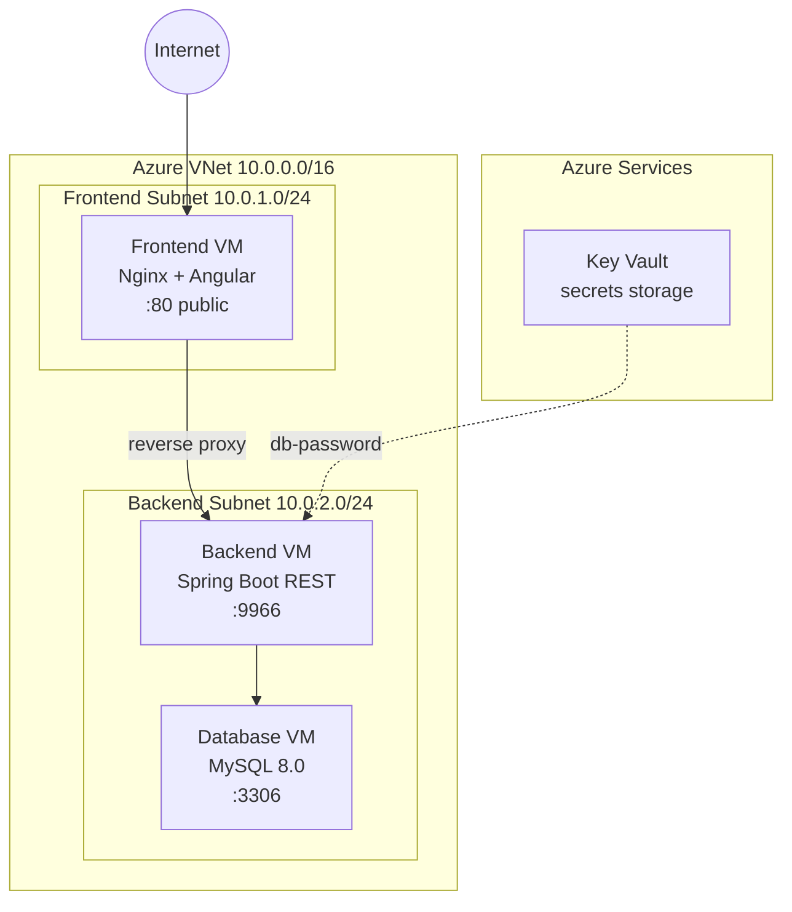

# PetClinic Azure Deployment

Fully automated deployment of a **3-tier web application** on Microsoft Azure. A single Python command provisions the complete cloud infrastructure from scratch (virtual network with isolated subnets, security groups, three Linux VMs) and deploys the entire application stack: Angular frontend behind Nginx reverse proxy, Spring Boot REST API, and MySQL database.

## Quick Start

### Prerequisites

- Python 3.10+
- [Azure CLI](https://learn.microsoft.com/en-us/cli/azure/install-azure-cli) installed
- An active Azure subscription with `Microsoft.KeyVault` provider registered

### Deploy

```bash
az login
python3 main.py
```

With live output from all commands:

```bash
python3 main.py --verbose
```

### Clean up

```bash
python3 cleanup.py
```

## Architecture



**Traffic flow:** User &rarr; Nginx (:80) &rarr; reverse proxy &rarr; Spring Boot (:9966) &rarr; MySQL (:3306)


## Tech Stack

| Layer | Technology |
|---|---|
| Cloud | **Azure** (VMs, VNet, NSG, Public IP, Key Vault) |
| Automation | **Python 3.10+**, **Bash** |
| Networking | VNet with subnet isolation, NSGs, Nginx reverse proxy, SSH jump host |
| Frontend | Angular, Nginx |
| Backend | Spring Boot REST API, Java 17, Maven |
| Database | MySQL 8.0 |
| OS | **Linux** (Ubuntu) |
| Version Control | **Git**, **GitHub** |

## Key Features

- **Infrastructure as Code** - entire cloud environment defined declaratively in `config.yaml`
- **Secret management** - database password stored in Azure Key Vault instead of plaintext
- **Network security** - backend and database VMs have no public IPs; all provisioning goes through an SSH jump host; NSG rules follow least-privilege principle
- **Parallel provisioning** - all 3 VMs are created simultaneously to minimize deployment time
- **Health checks** - each service (MySQL, Spring Boot, Nginx) is verified before proceeding to the next step
- **End-to-end verification** - automated post-deployment test confirms the full stack (frontend &rarr; backend &rarr; DB) is responding
- **Idempotent teardown** - `cleanup.py` removes all resources including Key Vault purge
- **Structured logging** - timestamped logs for every Azure CLI call and SSH session

## Network Security

Backend and database VMs have **no public IP addresses**. All SSH provisioning is done through the frontend VM as a jump host. NSG rules restrict traffic to:

| Rule | Port | Source | Subnet |
|---|---|---|---|
| HTTP | 80 | Internet | Frontend |
| SSH | 22 | Internet | Frontend |
| Spring Boot API | 9966 | VirtualNetwork | Backend |
| MySQL | 3306 | VirtualNetwork | Backend |
| SSH (internal) | 22 | VirtualNetwork | Backend |

## Project Structure

```
PetClinicDeployment/
├── main.py                  # entry point - full deployment
├── cleanup.py               # tears down all Azure resources
├── config.yaml              # declarative infrastructure configuration
├── core/
│   ├── azure.py             # Azure CLI wrapper with logging
│   ├── config.py            # YAML config loader & validator
│   ├── context.py           # runtime context (verbose, log dir)
│   ├── deploy.py            # SSH execution & E2E verification
│   ├── infrastructure.py    # Azure resource provisioning
│   └── utils.py             # terminal colors
└── scripts/
    ├── setup_db.sh          # MySQL installation & config
    ├── setup_backend.sh     # Spring Boot build & systemd setup
    └── setup_frontend.sh    # Angular build & Nginx config
```

## Configuration

All infrastructure parameters are defined in `config.yaml` - VM sizes, network addressing, subnet layout, NSG rules, database credentials, and Key Vault name. No values are hardcoded in the Python source.

## Logs

Each deployment run creates a timestamped directory under `logs/` containing:
- `azure.log` - all Azure CLI command outputs
- `setup_db.log`, `setup_backend.log`, `setup_frontend.log` - SSH script outputs
